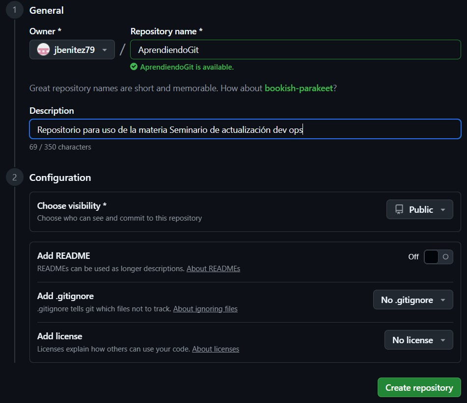

# Primer TP de Seminario Seminario de actualización dev ops
## Autor: Julian Benitez

## Pasos a realizar

#### Instalar y configurar Git definiendo el nombre del usuario, el email y activar los colores de la salida. mostrar la configuración final.

Descargue la herramienta Git desde la pagina de git-scm.com. Luego procedi a su instalacion.  Por ultimo configure mi nombre, mail y la configuracion de color en always.
~~~
C:\Users\benit>git config --global user.name "Julian Benitez"
C:\Users\benit>git config --global user.email "jibenitez79@gmail.com"
C:\Users\benit>git config --global color.ui always
C:\Users\benit>git config --list
diff.astextplain.textconv=astextplain
filter.lfs.clean=git-lfs clean -- %f
filter.lfs.smudge=git-lfs smudge -- %f
filter.lfs.process=git-lfs filter-process
filter.lfs.required=true
http.sslbackend=schannel
core.autocrlf=true
core.fscache=true
core.symlinks=false
pull.rebase=false
credential.helper=manager
credential.https://dev.azure.com.usehttppath=true
init.defaultbranch=main
user.name=Julian Benitez
user.email=jibenitez79@gmail.com
color.ui=always
~~~

### Crear un repositorio nuevo con el nombre AprendiendoGit y mostrar su contenido.
Ingreso a GitHub y creo el repositorio solicitado.

Luego en mi pc ejecuto:
git init AprendiendoGit
Esto crea una carpeta vacia.

### Crear un archivo de texto llamado Readme.md e ingresarle el texto " Git Fundamentos"
Creamos el archivo con el texto "Git Fundamentos"

### Comprobar de nuevo el estado del repositorio.
Ejecuto git status y esto me indica que tenemos un archivo sin seguimiento (track)
~~~
$ git status
On branch main

No commits yet

Untracked files:
  (use "git add <file>..." to include in what will be committed)
        Readme.md

nothing added to commit but untracked files present (use "git add" to track)
~~~

#### Añadir el fichero a la zona de intercambio temporal.  
` git add Readme.md `

#### Volver a comprobar una vez más el estado del repositorio.
~~~
$ git status
On branch main

No commits yet

Changes to be committed:
  (use "git rm --cached <file>..." to unstage)
        new file:   Readme.md
~~~

#### Abrir el repositorio con visual Studio Code 
` C:\Users\benit>code AprendiendoGit `

#### Agregar la fecha actual al archivo Readme.md y realizar un commit con el mensaje “Fecha”

#### Agregar un archivo “index.html” con el contenido “Introduccion a GIT “ en encabezado y con formato html

#### Mostrar todos los cambios en el repositorio
~~~
$ git log
commit 8ae212c3cd5e007b104b4c810b2368cede57567a (HEAD -> main)
Author: Julian Benitez <jibenitez79@gmail.com>
Date:   Sat Aug 16 18:14:42 2025 -0300

    add index.html

commit b6342d018b51dc9d5244b72186dc33a02712a750
Author: Julian Benitez <jibenitez79@gmail.com>
Date:   Sat Aug 16 18:11:55 2025 -0300

    fecha
~~~
